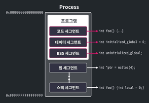

# Linux Memory Layout
이 파일에는 리눅스의 메모리 구조에 대해 간단하게 정리한다.

# Overview
- Segment
- Code Segment
- Data Segment
- BSS Segment
- Stack Segment
- Heap Segment

## Segment
리눅스에서는 프로세스의 메모리를 크게 5가지의 세그먼트로 구분한다. 여기서 세그먼트란 적재되는 데이터의 용도별로 메모리의 구획을 나눈것인데, 크게 **Code, Data, BSS, Stack, Heap**으로 구분한다.



메모리를 용도별로 나누면, 각 용도에 맞게 적절한 권한을 부여할 수 있다. 권한은 **rwx(읽기, 쓰기, 실행)** 이 존재하며, CPU는 메모리에 대해 권한이 부여된 행위만 할 수 있다.

### Code Segment
코드 세그먼트는 **실행 가능한 기계 코드**가 위치하는 영역으로, **Text Segment**라고도 불린다.  

프로그램이 동작하려면 코드를 실행할 수 있어야 하므로 이 세그먼트에는 읽기 권한과 실행 권한이 부여된다. **(r-x)** 반면 쓰기 권한이 있으면 공격자가 악의적인 코드를 삽입하기가 쉬워지므로, 대부분의 현대 운영체제는 이 세그먼트에서 쓰기 권한을 제거한다.

```c
int main() { return 31337; }
```

위의 정수 31337을 반환하는 main함수가 컴파일 되면 554889e5b8697a00005dc3라는 기계 코드로 변환되는데, 이 기계 코드가 코드 세그먼트에 위치하게 된다.

### Data Segment
데이터 세그먼트에는 **컴파일 시점에 값이 정해진 전역 변수 및 전역 상수**들이 위치한다. CPU가 이 세그먼트의 데이터를 읽을 수 있어야 하므로, 읽기 권한이 부여된다.  

데이터 세그먼트는 쓰기가 가능한 세그먼트와 쓰기가 불가능한 세그먼트로 다시 분류된다.  

- Data Segment
  - data (rw-)
  - rodata (r--)

쓰기가 가능한 data 세그먼트에는 전역 변수와 같이 프로그램이 실행되면서 **값이 변할 수 있는 데이터**들이 위치한다.  

반면 쓰기가 불가능한 rodata 세그먼트에는 프로그램이 실행되면서 **값이 변하면 안되는 데이터**들이 위치한다. 전역으로 선언된 상수가 여기에 포함된다.

```c
int data_num = 31337;                       // data
char data_rwstr[] = "writable_data";        // data
const char data_rostr[] = "readonly_data";  // rodata
char *str_ptr = "readonly";  // str_ptr은 data, 문자열은 rodata

int main() { ... }
```

위의 예시에서, 전역 변수 **data_num, data_rwstr**은 각각 정수 값 31337, 문자형 배열 "writable_data"의 첫 번째 문자 'w'의 주소를 값으로 갖는다. 이는 프로그램 실행 중 값이 변할 수 있으므로 data 세그먼트에 위치한다.  
그러나, 전역 변수 **data_rostr**은 키워드 const를 사용하여 data_rostr 과 "readonly_data" 모두 값이 변할 수 없도록 하였다. 따라서 rodata 세그먼트에 위치한다.   
또, 전역 변수 **str_ptr**은 문자열 "readonly"의 첫 번째 문자 'r'의 주소를 값으로 갖는다. 문자 배열과는 다르게 문자열은 프로그램이 실행되면서 값을 변경할 수 없다. 따라서, 주소를 저장하는 str_ptr은 data 세그먼트에, 변하지 않는 값인 "readonly" 문자열은 rodata 세그먼트에 위치하게 된다.

### BSS Segment
BSS 세그먼트에는 **컴파일 시점에 값이 정해지지 않은 전역 변수**가 위치한다. 여기에는 개발자가 선언만 하고 초기화하지 않은 전역변수 등이 포함된다. 이 세그먼트의 메모리 영역은 프로그램이 시작될 때, 모두 0으로 값이 초기화된다. 이런 특성 때문에 C 코드를 작성할 때, 초기화되지 않은 전역 변수의 값은 0이 된다.  

이 세그먼트에는 읽기 권한 및 쓰기 권한이 부여된다. **(rw-)**

```c
int bss_data;

int main() {
  printf("%d\n", bss_data);  // 0
  return 0;
}
```

위의 코드에서 초기화되지 않은 전역 변수인 bss_data가 BSS 세그먼트에 위치한다.

### Stack Segment
스택 세그먼트는 프로세스의 스택이 위치하는 영역이다. 함수의 인자나 지역 변수와 같은 **임시 변수**들이 실행중에 여기에 저장된다.  

스택 세그먼트는 **Stack Frame**이라는 단위로 사용된다. 스택 프레임은 함수가 호출될 때 생성되고, 반환될 때 해제된다. 그런데 어떤 프로세스가 실행될 때, 이 프로세스가 얼마 만큼의 스택 프레임을 사용하게 될 지를 미리 계산하는 것은 일반적으로 불가능하므로 운영체제는 프로세스를 시작할 때 작은 크기의 스택 세그먼트를 먼저 할당하고 부족해질 때마다 이를 확장한다. 스택은 높은 주소에서 낮은 주소로 확장된다.  

이 영역에는 CPU가 자유롭게 값을 읽고 쓸 수 있어야 하므로, 읽기와 쓰기 권환이 부여된다. **(rw-)**  

지역 변수가 선언/정의된 순서와 다르게 스택에 배치되어 있는 경우가 있는데 이는 컴파일러가 여러가지 요인을 고려하여 배치하는 것으로, 순서를 예측하는 것이 거의 불가능하다. 따라서 스택에 저장된 지역변수의 순서를 알고싶다면, 반드시 디버깅을 통해 확인해야 한다.


### Heap Segment
힙 세그먼트는 힙 데이터가 위치하는 세그먼트이다. 스택과 마찬가지로 프로그램 실행중에 동적으로 할당될 수 있고, 리눅스에서는 스택 세그먼트와 반대 방향으로 확장된다. 이는 스택 세그먼트와 힙 세그먼트가 충돌하는 것을 최대한 막기 위한 설계이다.  

C언어에서 malloc(), calloc() 등을 호출해서 할당받는 메모리가 이 세그먼트에 위치하며, 일반적으로 읽기와 쓰기 권한이 부여된다. **(rw-)**

```c
int main() {
  int *heap_data_ptr =
      malloc(sizeof(*heap_data_ptr));  // 동적 할당한 힙 영역의 주소를 가리킴
  *heap_data_ptr = 31337;              // 힙 영역에 값을 씀
  printf("%d\n", *heap_data_ptr);  // 힙 영역의 값을 사용함
  return 0;
}
```

위의 코드는 heap_data_ptr에 malloc()으로 동적 할당한 영역의 주소를 저장하고, 이 영역에 값을 쓴다. 여기서 heap_data_ptr은 지역변수이므로 스택에 위치하며, malloc()으로 할당받은 힙 세그먼트의 주소를 가리킨다.

참고 : [Linux Memory Layout](https://dreamhack.io/lecture/courses/52)
